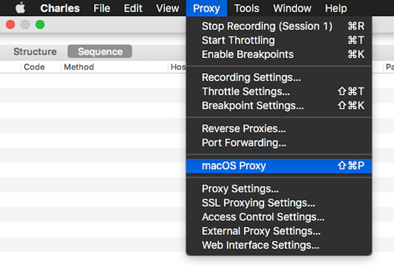
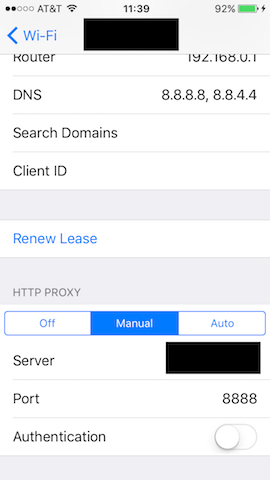
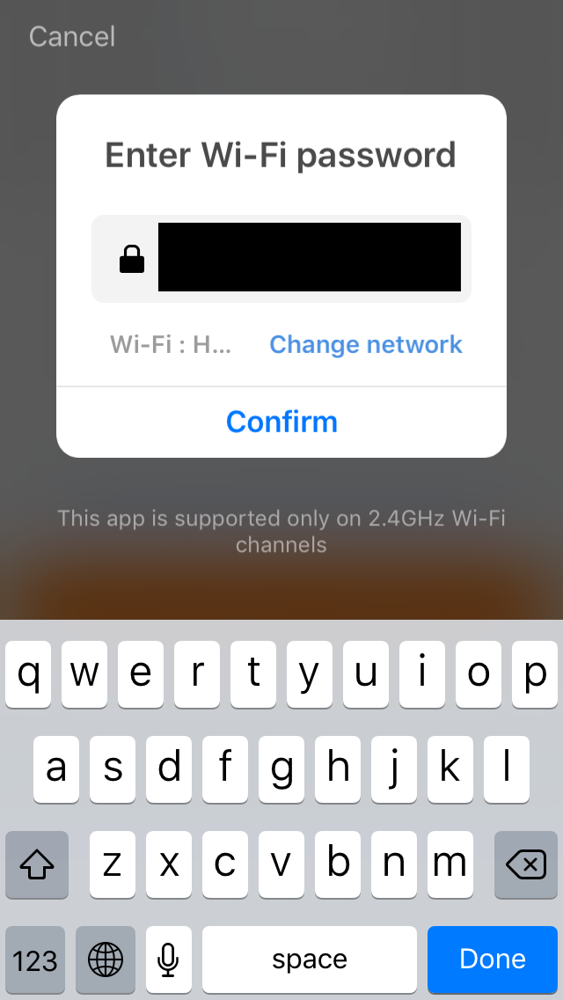

Setup
=========

## macOS

1. Download [Charles](https://www.charlesproxy.com).
2. Turn off the local proxy for your computer:



3. And turn off recording for now (with the red button), so it's easier to find the correct data later on:


4. Setup Charles' [SSL certificate](https://www.charlesproxy.com/documentation/using-charles/ssl-certificates/) for your phone.
5. Proxy your phone's traffic through Charles (IP is the IP of your computer):



6. Launch the app that came with your device. If you've already added the device you want to configure to the app, remove it now.
7. Add your device. Before tapping "Continue" after entering your network's password, pause and turn back on traffic recording in Charles.



8. When the device is added in the app, turn off traffic recording in Charles.
9. Find the HTTPS request where `a=s.m.dev.list`:


10. Find the parameters needed for constructing a TuyAPI instance from the contents of the response:
```
{
  id: uuid,
  uid: productId,
  key: localKey
}
```


## Android


### Capture https traffic

Only requires an Android device. Root not required, this captures the stream from the Android application to the Jinvoo/Tuya web servers. It does NOT capture between Android device and remote control device.

1) Remove registration for existing device if present

2) Install "Packet Capture" https://play.google.com/store/apps/details?id=app.greyshirts.sslcapture (follow instructions, install cert, then start capturing, its possibly to use the green triangle/play button with a "1" on it to only capture from the Jinvoo app).

3) Run Jinvoo Smart App (https://play.google.com/store/apps/details?id=com.xenon.jinvoo version 1.0.3 known to work) to (re-)add device.

4) Hit stop button back in "Packet Capture" app.

5) review captured packets (first or last large one, 9Kb of 16Kb) use macOS step 11 for guide.

### Extract details from android config file


#### Smart Life App
From https://github.com/codetheweb/tuyapi/issues/5#issuecomment-352932467

If you have a rooted Android phone, you can retrieve the settings from the app (Smart Life) data storage. The keys/configured devices are located at /data/data/com.tuya.smartlife/shared_prefs/dev_data_storage.xml

There's a string in there (the only data) called "tuya_data". You need to html entity decode the string and it contains a JSON string (yes, this is slightly ridiculous). Inside the JSON string are the keys.

#### Jinvoo Smart App

The Jinvoo SMart app is similar to the Smart Life app but has a slightly different location. `/data/data/com.xenon.jinvoo/shared_prefs/gw_storage.xml`. Python script to dump out the information along with useful schema information:

    #!/usr/bin/env python
    # -*- coding: us-ascii -*-
    # vim:ts=4:sw=4:softtabstop=4:smarttab:expandtab
    #

    import codecs
    import os
    import json
    import xml.etree.ElementTree as ET

    try:
        # Python 2.6-2.7 
        from HTMLParser import HTMLParser
    except ImportError:
        # Python 3
        from html.parser import HTMLParser  ## FIXME use html.unescape()?


    xml_in_filename = 'com.xenon.jinvoo/shared_prefs/gw_storage.xml'
    h = open(xml_in_filename, 'r')
    xml = h.read()
    h.close()

    builder = ET.XMLTreeBuilder()
    builder.feed(xml)
    tree = builder.close()


    h = HTMLParser()
    for entry in tree.findall('string'):
        if entry.get('name') == 'gw_dev':
            # found it, need content
            config = entry.text
            s = h.unescape(config)
            config_dict = json.loads(s)
            #print(config_dict)
            print(len(config_dict))
            for device in config_dict:
                #print(device)
                for key in ['name', 'localKey', 'uuid', 'gwType', 'verSw', 'iconUrl']:  # and/or 'gwId', 'devId'
                    print('%s = %r' % (key, device[key]))
                # there is a bunch of interesting meta data about the device
                print('schema =\\')
                schema = device['devices'][0]['schema']  # NOTE I've only seen single entries
                schema = h.unescape(schema)
                schema_dict = json.loads(schema)
                print(json.dumps(schema_dict, indent=4))
                print('')
            print(json.dumps(config_dict, indent=4))
